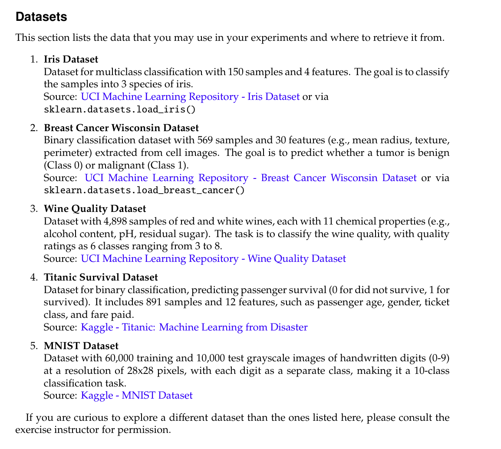

# Data_Mining_Project
This repo contains my implementation for data mining project in my master course

## Task2: Classification Experiments
- The main goal of this task is to implement K-Nearest-Neighbor classifier and compare its results to available algorithms and implementations. 

### List of requirements: 
1. To implement Python class named KNNClassifier that performs classification using KNN algorithm.
2. The implementation should include:
   1. fit(X,Y): method that stores the training data. 
   2. predict(X): method that predicts the class labels for the provided data points. 

### How to proceed:
1. We should select two datasets from this list: 
   1. 
   2. I chose:
      1. Iris Dataset.
      2. Breast Cancer Wisconsin.
2. Then train and evaluate our KNNClassifier implementation on both datasets.
3. Also, we should do the same for KNN classifier and a third classifier of our choice from scikit-learn for comparison. 
4. We must also choose suitable hyper-parameters and split our data into:
   1. TR: Training Data.
   2. TE: Testing Data.

### Evaluation
- For each classifier, we should record: 
  - Accuracy on test set.
  - Running time on training and testing. 
  - Confusion matrix.
- And at the end we should write a scientific report summarizing our results around (2-3 pages), which should include: 
  1. Experiment Setup:
     - What are the used datasets, and how does they look like. 
     - What are the used classifiers, and breif about each of them. 
     - How many different runs were executed for a certain traininig/test split. 
     - How were the parameters for the classification method optimized.
  2. Presentation of results
     - Accuracy scores for each classifier
     - Runtime for training and prediction for each classifier on each dataset. 
     - Visualisation of the trained classification model
  3. Discussion of the results.
- At the end we should also provide a conclusion with short analysis for the results, and any observed differences in accuracy or runtime between our implementation and scikit-learn versions.   

### Solution
> You can find my analysis and solution in the [data_mining_project_solution notebook](./data_mining_project_solution.ipynb) 